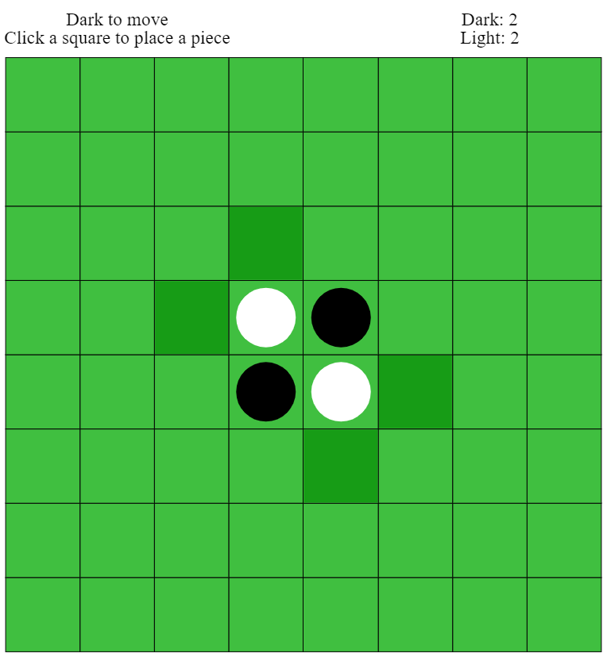
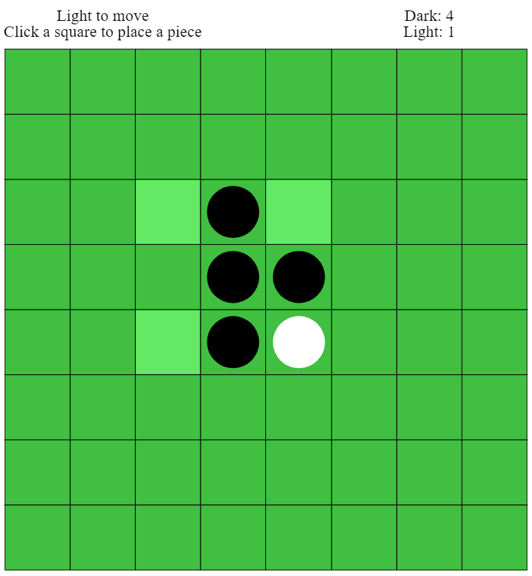

# Othello AI

An AI that plays [Othello (also
known as Reversi)](https://en.wikipedia.org/wiki/Reversi), a classic
board game.

We have implemented the rules of the game for you, but you
will have to decide how best to play the game.

{:.msg-info}
This assignment is worth 15% of your final grade.

{:.msg-warn}
**Deadline**: Saturday 29th May, 2021, at 11:00pm Canberra time *sharp*

*Deadline for report only: Sunday 30th May, 2021, at 11:00pm Canberra time sharp* 
We introduce this seperate deadline for report ONLY to give more time for quality report. 
No other parts of assignment will be accepted for this deadline except `Report.pdf`.


## Overview of Tasks

This assignment is marked out of 100 (120 for 1130):

| **Task**              | **COMP1100** | **COMP1130** |  
|-----------------------|--------------|--------------|
| Main Task: Othello AI | 55 Marks     | 65 Marks     |
| Unit Tests            | 10 Marks     | 10 Marks     |
| Style                 | 10 Marks     | 10 Marks     |
| Technical Report      | 25 Marks     | 35 Marks     |

{:.msg-warn}
As with assignment 2, code that does not compile will be
penalised. This means that **both** the commands `cabal v2-run game`
(with sensible arguments) **and** `cabal v2-test` must run without
errors. If **either** command fails with an error, a mark deduction
will be applied. If you have a partial solution that you cannot get
working, you should comment it out and write an additional comment
directing your tutor's attention to it.


## Getting Started

Fork the assignment repository and create a project for it in VSCode,
following the same steps as in [Lab
2](https://cs.anu.edu.au/courses/comp1100/labs/02/#forking-a-project). The
assignment repository is at
<https://gitlab.cecs.anu.edu.au/comp1100/comp1100-assignment3>.


## Overview of the Game

Othello (also known as Reversi) is a board game played on an 8x8 board
with 64 discs. Each disc is light on one side and dark on the other.
The game starts with 4 discs in the centre of the board: two dark and
two light.



To make a move, a player places a disc with their colour facing up on
an unoccupied square on the board, such that it will capture at least
one of the opponents discs.

Capturing occurs if the placed disc forms a line (horizontal, vertical
or diagonal) that has one or more of the opponents discs on it and is
ended by another of the current player's discs, with none of the current
player's discs in-between. All of the opponents
discs on this line are flipped over, becoming the current player's discs.
It is possible (and in fact quite common) for a single move to capture more
than one line, and all the pieces which can be captured in a move must be
captured (flipped).



The dark player plays first, and play alternates between the two
players.  If a player can't make a legal move, their turn is
skipped. If neither player can make a legal move, the game is over and
the player with the most discs wins.


## Overview of the Repository

Most of your code will be written in `src/AI.hs`, but you will also
need to write tests in `src/AITests.hs`. 

{:.msg-warn}
The only files you are allowed to modify in your submission are
`src/AI.hs` and `src/AITest.hs`. Any other modifications risk
changing the rules of the game, so you would be playing a different
game to the one in the assignment. Doing so may impact the tournament 
and your marks.

### Other Files

* `src/Othello.hs` implements the rules of Othello. You should read
  through this file and familiarise yourself with the data
  declarations and the type signatures of the functions in it, as you
  will use some of these to analyse the game states. You do not need
  to understand how every function in this file works in detail.

* `src/OthelloTests.hs` implements some unit tests for the game. You
  are welcome to read through it.

* `src/AITests.hs` is an empty file for you to write tests for your
  agent.

* `src/Testing.hs` is a simple test framework like the one in
  Assignment 2. It has been extended so that you can group related
  tests together for clarity.

* `src/Dragons` contains all the other code that makes the framework
  go. You do not need to read or understand anything in this
  directory. Here be dragons! (On medieval maps they drew pictures of
  dragons or sea monsters over uncharted areas.) The code in those
  files is beyond the areas of Haskell which this course explores.

* `Setup.hs` tells cabal that this is a normal package with no unusual
  build steps. Some complex packages (that we will not see in this
  course) need to put more complex code here. You are not required to
  understand it.

* `comp1100-assignment3.cabal` tells the cabal build tool how to build
  your assignment. We will discuss how to use `cabal` below.

* `.ghcid` tells the `ghcid` tool which command to run, which is what
  supplies VSCodium with error highlighting that automatically updates
  when you save a file.

* `.gitignore` tells `git` which files it should not put into version
  control. These are often generated files, so it doesn't make sense
  to place them under version control.

## Overview of Cabal

As before, we are using the `cabal` tool to build the assignment
code. The commands provided are very similar to last time:

* `cabal v2-build`: Compile your assignment.

* `cabal v2-run game`: Build your assignment (if necessary), and run
  the test program. We discuss the test program in detail below, as
  there are a number of ways to launch it.

* `cabal repl comp1100-assignment3`: Run the GHCi interpreter over
  your project so you can test functions interactively.

* `cabal v2-test`: Build and run the tests. This assignment is set up
   to run a unit test suite, and as with Assignment 2 you will be
   writing tests. The unit tests will abort on the first failure, or
   the first call to a function that is `undefined`.

* `cabal v2-haddock`: Generate documentation in HTML format, which you
  can read with a web browser (simply by copying the path for index.html to the 
  web browser). This might be a nice way to read a
  summary of the game module, but it also documents the `Dragons`
  modules which you can safely ignore.

{:.msg-info}  
You should execute these cabal commands in the **top-level directory**
of your project: `comp1100-assignment3` (i.e., the directory you are
in when you launch a terminal from VSCode).

## Overview of the Test Program

To run the test program, you need to provide it with command line
arguments that tell it who is playing. This command will let you play
against the `firstLegalMove` AI bot:

```
cabal v2-run game -- --p1 human --p2 ai:firstLegalMove
```

In general, the command to run the game looks like this:

```
cabal v2-run game -- ARGS
```

Replace `ARGS` with a collection of arguments from the following list:

* `--timeout DURATION`: Change the amount of time (in decimal seconds)
  that AI functions are given (default = `4.0`). You may want to set
  this to a smaller number when testing your program, so that things
  run faster.

* `--debug-lookahead`: When an AI is done thinking, print out how many
  moves ahead it considered, and the candidate move it came up with at
  each level of lookahead. The first item in the printed list is the
  move it came up with at lookahead 1, the second item is the move it
  came up with at lookahead 2, and so on.

* `--ui codeworld`: Show the game using CodeWorld. This is the default
  user interface. Use your web browser to play the game, as in
  previous assignments. Unlike the codeworld programs in previous
  assignments, you must terminate the program with `Ctrl+C` and
  restart it if you want to restart your game.

* `--ui text`: Show the game in the terminal.

* `--ui json`: Run a non-interactive game (i.e., AI vs. AI, or AI *vs*
  network), and output a report of the game in JSON format. You
  probably won't have a use for this, but it's documented here for
  completeness.

* `--host PORT`: Listen for a network connection on `PORT`. You only
  need this for network play (see below).

* `--connect HOST:PORT`: Connect to someone else's game. You only need
  this for network play (see below).

* `--player1 PLAYER`: Specify the white player. Required.

* `--player2 PLAYER`: Specify the black player. Required.

The `PLAYER` parameters describe who is playing, and can take one of
the following forms:

| **Format**  | **Effect**                                                  |
|-------------|-------------------------------------------------------------|
| `human`     | Ask the person at the computer for moves.                   |
| `ai`        | Ask the `"default"` AI for moves.                           |
| `ai:AINAME` | Ask a specific AI for moves (example: `ai:firstLegalMove`). |
| `network`   | Wait for a move from the network.                           |

### Network Play

{:.msg-warn}  
Network play is provided in the hope that it will be useful, but we
are unable to provide support for this feature, or diagnose problems
related to tunnelling network connections between computers.

The assignment framework supports network play, so that you can test
agents against each other without sharing code. One machine must
_host_ the game, and the other machine must _connect_ to the game. In
the example below, machine A hosts a game on port 5000 with the agent
`crashOverride` as player 1, then machine B connects to the game,
providing the AI `chinook` as player 2:

```
# On Machine A:
cabal v2-run game -- --host 5000 --p1 ai:crashOverride --p2 network

# On Machine B (you'll need Machine A's external IP address somehow):
cabal v2-run game -- --connect 198.51.100.66:5000 --p1 network --p2 ai:chinook
```

{:.msg-info}  
Under the bonnet, the network code makes a single TCP connection, and
moves are sent over the network in JSON. You will need to set up your
modem/router to forward connections to the machine running your
assignment. A service like [ngrok](https://ngrok.com/) may help, but
as previously mentioned we are unable to provide any support for this
feature.


## Main Task: Othello AI (COMP1100: 55 Marks, COMP1130: 65 Marks)

### Your Task

Implement an AI (of type `AI`) for Othello in `src/AI.hs`. There is a
list called `ais` in that file, and **we will mark the AI you call
"default" in that list.**

We will test your AI's performance by comparing it to implementations
written by course staff, using a variety of standard approaches. Its
performance against these AIs will form a large part of the marks for
this Task.

{:.msg-warn}
It is **vital** that you indicate one AI as "default", otherwise we will
not know which one to mark.

## Understanding the `AIFunc` Type

The `AIFunc` type has two constructors, depending on whether you are
implementing a simple AI that looks only at the current state, or a
more complicated AI that performs look-ahead.

The `NoLookahead` constructor takes as its argument a function of type
`GameState -> Move`. That is, the function you provide should look at
the current state of the game and return the move to play. This
constructor is intended for very simple AIs that do not look ahead in
the game tree.

The `WithLookahead` constructor takes as its argument a function of
type `GameState -> Int -> Move`. The `Int` parameter may be used to
represent how many steps you should try to look ahead in the game
tree. The assignment framework will call your function over and over,
with look-ahead `1`, then `2`, then `3`, etc., until it runs out of
time. The framework will take the result of the most recent successful
function call as your AI's best move. If your AI does not return a
move in time, the program will stop with an error.


### Discussion

Your AI should inspect the `Turn` within the `GameState` to see whose turn
it is. You may call `error` if the `Turn` is `GameOver` - your AI
should never be called on a finished game. Your AI can then use the
`Player` value and `otherPlayer` function to work out how to evaluate the
board.

{:.msg-info}

You may also assume that we will only ever call your AI if there is a
legal move it can make. In particular, this means that we will not
deduct marks for assuming that a list of legal moves is non-empty
(e.g., you used the `head` function). Note that gratuitous use of
`head` and `tail` is still poor style.

This is a very open-ended task, and it will probably help if you build
up your solution a little at a time. We suggest some approaches below.

### First Legal Move

The simplest AI you can build is one that makes the first legal move
it can. We have provided this for you, so you can see what a simple
`AI` looks like.

### Interlude: Heuristics

Heuristic functions were discussed in [the lecture on game
trees](https://cs.anu.edu.au/courses/comp1100/lectures/09-2-Game_Trees.pdf). We
expect the quality of your heuristic function - how accurately it
scores game states - to have a large impact on how well your AI
performs.

### Greedy Strategy

"Greedy strategies" are the class of strategies that make moves that
provide the greatest _immediate_ advantage. In the context of this
game, it means always making the move that will give it the greatest
increase in heuristic. Try writing a simple heuristic and a greedy
strategy, and see whether it beats your "first legal move" AI.

### Interlude: Game Trees

To make your AI smarter, it is a good idea for it to look into the
future and consider responses to its moves, its responses to those
responses, and so on. The lecture on game trees may help you here.

{:.msg-warn}
It is possible for one player to make two moves in a row, if the
opponent has no legal move. Therefore, it is not safe to assume that
each layer of the game tree is scored for opposing players.

### Minimax

Greedy strategies can often miss opportunities that need some
planning, and get tricked into silly traps by smarter opponents. The
Minimax Algorithm was discussed in the lecture on game trees and will
likely give better performance than a greedy strategy.

### Pruning

Once you have Minimax working, you may find that your AI exploring a
number of options that cannot possibly influence the result. Cutting
off branches of the search space early is called _pruning_, and one
effective method of pruning is called

 [Alpha-Beta
Pruning](https://cs.anu.edu.au/courses/comp1100/lectures/10-1-Alpha_Beta.pdf),
which was discussed in lectures.
Good pruning may allow your search to
explore deeper within the time limit it has to make its move.

### Other Hints

* There are four main ways your AI can be made smarter:

  - Lookahead: If your function runs efficiently, it can see further
    into the future before it runs out of time. The more moves into
    the future it looks, the more likely it will find good moves that
    are not immediately obvious. Example: at 1 level of lookahead, a
    move may let you capture a lot of dics, but at deeper lookahead
    you might see that it leaves you open to a large counter-capture.

  - Heuristic: You will not have time to look all the way to the end
    of every possible game. Your heuristic function guesses how good a
    `GameState` is for each player. If your heuristic is accurate, it will
    correctly identify strong and weak states.

  - Search Strategy: This determines how your AI decides which
    heuristic state to aim for. Greedy strategies look for the best
    state they can (according to the heuristic) and move towards that
    state. More sophisticated strategies like Minimax consider the
    opponent's moves when planning.

  - Pruning: if you can discard parts of the game tree without
    considering them in detail, you can process game trees faster and
    acheive a deeper lookahead in the allotted running
    time. Alpha-beta pruning is one example; there are others.

* Choosing a good heuristic function is very important, as it gives
  your AI a way to value its position that is smarter than just
  looking at current score. Perhaps you might find that some squares
  are more valuable than others, when it comes to winning games, and
  so your AI should value them more highly.

* Do not try to do everything at once. This does not work in production
  code and often does not work in assignment code either. Get something
  working, then take your improved understanding of the problem to the
  more complex algorithms.

* As you refine your AIs, test them against each other to see whether
  your changes are actually an improvement.

{:.msg-info}
You may notice that this task is the same for both COMP1100 and COMP1130
students, but that does not mean they will be marked the same. A COMP1130 
student can expect their mark out of 65 to be what a COMP1100 student 
would score out of 55, and - only if their submission exceeds what would score 
full marks for a COMP1100 submission - a mark above 55/65.

## Unit Tests (10 Marks)

As with Assignment 2, you will be expected to write unit tests to
convince yourself that your code is correct. The testing code has been
extended from last time - `src/Testing.hs` now allows you to group
tests into a tree structure. As before, you run the tests using `cabal
test`.

### Your Task

Add tests to `src/AITest.hs` that test your AI.

#### Hints

* Most of the hints from Assignment 2 apply here. Reread those.

* If a function is giving you an unexpected result, try breaking it
  into parts and writing tests for each part. This helps you isolate
  the incorrect parts, and gives you smaller functions to fix.

* If your function has subtle details that need to be correct, think
  about writing tests to ensure those details do not get missed as you
  work on your code.


## Style (10 Marks)

As you write increasingly complex code, it is increasingly important
that the code remains readable. This saves wasted effort understanding
messy code, which makes it easier to think about the problem and your
solution to it.

### Your Task

Ensure that your code is written in good Haskell style.

## Technical Report (COMP1100: 25 marks, COMP1130: 35 marks)

You should write a concise technical
report. An excellent report will:
demonstrate conceptual understanding of all major functions, and how
they interact when the program as a whole runs; explain your design
process, including your assumptions, and the reasons behind choices
you made; discuss how you tested your program, and in particular why
your tests give you confidence that your code is correct; and be well
formatted without spelling or grammar errors.

The **maximum word count** is **1500** for COMP1100 students, and **2500** for 
COMP1130 students. This is a *limit*, not a *quota*;
concise presentation is a virtue.

{:.msg-warn}
Once again: This is not a required word count. They are the **maximum
number of words** that your marker will read. If you can do it in
fewer words without compromising the presentation, please do so.

Your report must be in PDF format, located at the root of your
assignment repository on GitLab and named `Report.pdf`. Otherwise, it
may not be marked.

The report must have a **title page** with the following items:

* Your name
* Your laboratory time and tutor
* Your university ID

An excellent report will:
  * demonstrate conceptual understanding of all major
    functions, and how they interact when the program as a whole runs;
  * explain your design process, including your assumptions, and the reasons
    behind choices you made;
  * discuss how you tested your program, and in particular why your tests give
    you confidence that your code is correct; and
  * be well formatted without spelling or grammar errors.

### Content and Structure

Your audience is the tutors and lecturers, who are proficient at programming
and understand most concepts. Therefore you should not, for example, waste
words describing the syntax of Haskell or how recursion works. After reading
your technical report, the reader should thoroughly understand what problem
your program is trying to solve, the reasons behind major design choices in it,
as well as how it was tested. Your report should give a broad overview of your
program, but focus on the specifics of what *you* did and why.

Remember that the tutors have access to the above assignment
specification, and if your report *only* contains details from it then
you will only receive minimal marks. Below is an potential outline for
the structure of your report and some things you might discuss in it.

#### Introduction

If you wish to do so you can write an introduction. In it, give:

* A brief overview of your program:

  - how it works; and
  - what it is designed to do.

#### Content

Talk about why you structured the program the way you did. Below are some
questions you could answer:

* Program design
  - Describe what each relevant function does conceptually. (i.e. how
    does it get you closer to solving the problems outlined in this
    assignment spec?)
  - How do these functions piece together to make the finished
    program? Why did you design and implement it this way?
  - What major design choices did *you* make regarding the functions
    that *you’ve* written, and the overall structure of your program?

  - For this assignment specifically, you could also ask yourself:
    - How does your AI select a good move?
    - What data structures did you choose, and why?
    - How did you develop the AI that is your main submission?

* Assumptions
  - Describe assumptions you have made
    and how this has influenced your design decisions.

* Testing
  - How did you test individual functions?
    - Be specific about this - the tutors know that you have tested
      your program, but they want to know *how*.
    - Describe the tests that prove individual functions on their own
      behave as expected (e.g. testing a function with different
      inputs and doing a calculation by hand to check that the outputs
      are correct).
  - How did you test the entire program? What tests did you perform to
    show that the program behaves as expected in all (even unexpected)
    cases?
  - How did you test the quality of your AI's play?

* Inspiration / external content
  - What resources did you use when writing your program (e.g.,
    published algorithms)?
  - If you have used resources such as a webpage describing an
    algorithm, be sure to cite it properly at the end of your report
    in a ‘References’ section. References do not count to the maximum
    word limit.

#### Reflection

Discuss the reasoning behind your decisions, rather than *what* the
decisions were. You can reflect on not only the decisions you made,
but the process through which you developed the final program:

* Did you encounter any conceptual or technical issues?
  - If you solved them, describe the relevant details of what happened
    and how you overcame them.
  - Sometimes limitations on time or technical skills can limit how
    much of the assignment can be completed. If you ran into a problem
    that you could not solve, then your report is the perfect place to
    describe it. You could include details such as:

    - Theories as to what caused the problem;
    - Suggestions of things that might have fixed it; and
    - Discussion about what you did try, and the results of these attempts.

* What would you have done differently if you were to do it again?
  - What changes to the design and structure you would make if you
    wrote the program again from scratch?

* Are parts of the program confusing for the reader? You can explain
  them in the report (in this situation you should also make use of
  comments in your code).

* If you collaborated with others, what was the nature of the
  collaboration?  (Note that you are only allowed to collaborate by
  sharing ideas, not code.)
  - Collaborating is any discussion or work done together on planning
    or writing your assignment.

* Other info
  - You may like to briefly discuss details of events which were
    relevant to your process of design - strange or interesting things
    that you noticed and fixed along the way.

{:.msg-info}
This is a list of **suggestions**, not requirements. You should only
discuss items from this list if you have something interesting to
write.

### Things to avoid in a technical report

* Line by line explanations of large portions of code. (If you want to
  include a specific line of code, be sure to format as described in
  the "Format" section below.)
* Pictures of code or IntelliJ.
* Content that is not your own, unless cited.
* Grammatical errors or misspellings. Proof-read it before submission.
* Informal language - a technical report is a professional document, and as
  such should avoid things such as:
  - Unnecessary abbreviations (atm, btw, ps, and so on), emojis, and
    emoticons; and
  - Stories / recounts of events not relevant to the development of the program.
* Irrelevant diagrams, graphs, and charts. Unnecessary elements will
  distract from the important content. Keep it succinct and focused.

If you need additional help with report writing, the [academic skills
writing
centre](http://www.anu.edu.au/students/academic-skills/appointments/academic-skills-writing-centre)
has a peer writing service and writing coaches.

### Format

You are not required to follow any specific style guide (such as APA
or Harvard). However, here are some tips which will make your report
more pleasant to read, and make more sense to someone with a computer
science background.

* Colours should be kept minimal. If you need to use colour, make sure it is
  absolutely necessary.
* If you are using graphics, make sure they are *vector* graphics (that stay
  sharp even as the reader zooms in on them).
* Any code, including type/function/module names or file names, that
  appears in your document should have a monospaced font (such as
  Consolas, Courier New, Lucida Console, or Monaco)
* Other text should be set in serif fonts (popular choices are Times,
  Palatino, Sabon, Minion, or Caslon).
* When available, automatic *ligatures* should be activated.
* Do not use underscore to highlight your text.
* Text should be at least 1.5 spaced.


## Communication

**Do not** post your code publicly, either on Piazza or via other
forums. Posts on Piazza trigger emails to all students, so if by
mistake you post your code publicly, others will have access to your
code and you may be held responsible for plagiarism.

Once again, and we cannot stress this enough: **do not post your code
publicly** . If you need help with your code, post it *privately* to the
instructors.

When brainstorming with your friends, **do not share code**. There
might be pressure from your friends, but this is for both your and
their benefit. Anything that smells of plagiarism will be investigated
and there may be serious consequences.

Sharing ideas and sketches is perfectly fine, but sharing should stop
at ideas.

Course staff will not look at assignment code unless it is posted
**privately** in piazza.

Course staff will typically give assistance by asking questions,
directing you to relevant exercises from the labs, or definitions and
examples from the lectures.

{:.msg-info}
Before the assignment is due, course staff will not give individual
tips on writing functions for the assignment or how your code can be
improved. We will help you get unstuck by asking questions and
pointing you to relevant lecture and lab material. You will receive
feedback on your work when marks are released.


## Submission Advice

Start early, and aim to finish the assignment several days before the
due date. At least 24 hours before the deadline, you should:

* Re-read the specification one final time, and make sure you've
  covered everything.

* Confirm that the latest version of your code has been pushed to
  GitLab by using your browser to visit
  https://gitlab.cecs.anu.edu.au/uXXXXXXX/comp1100-assignment3, where XXXXXXX
  is your student number.

* Ensure your program compiles and runs, including the `cabal v2-test`
  test suite.

* Proof-read and spell-check your report.

* Verify that your report is in PDF format, in the root of the project
  directory (not in `src`), and named `Report.pdf`. That capital `R`
  is important---Linux uses a case-sensitive file system. Check that
  you have successfully added it in GitLab.
